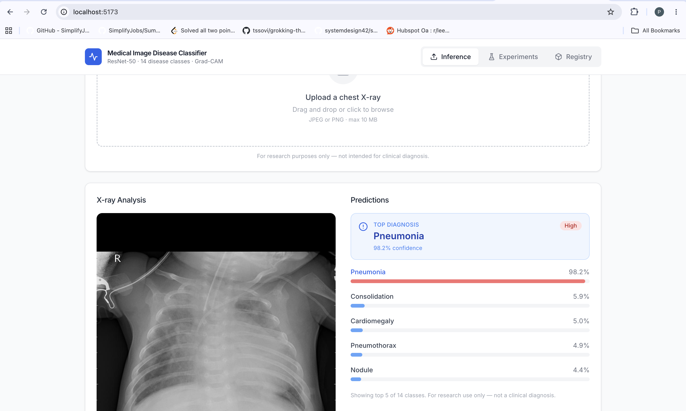
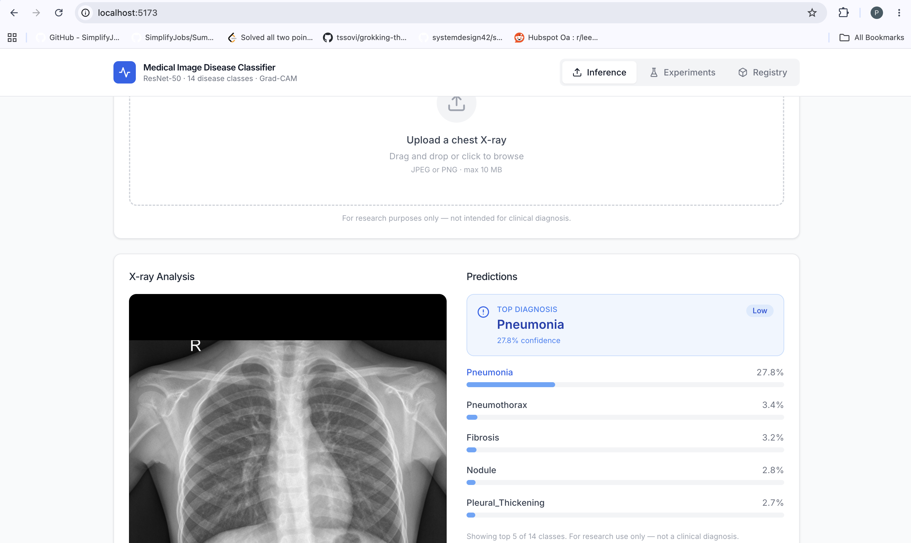

# Medical Image Disease Classifier

A chest X-ray disease classification system built with ResNet-50 and transfer learning. Upload a chest X-ray and the model predicts the probability of 14 different lung diseases. Built end-to-end with a FastAPI backend, React dashboard, and MLflow for experiment tracking.

## Demo

**Live:** https://medical-image-classifier-gamma.vercel.app  
**API:** https://medical-image-classifier-qyy3.onrender.com/docs  
**GitHub:** https://github.com/Preethi0602/Medical-Image-Classifier

### Pneumonia detected (98.2% confidence)


### Normal X-ray (low confidence — 27.8%)


## What it does

Upload a chest X-ray image and the system:
- Runs inference through a fine-tuned ResNet-50
- Returns probabilities for 14 disease classes
- Color-codes the risk level (red = high, blue = low)
- Logs the prediction through a FastAPI endpoint

The Experiments tab shows all training runs tracked in MLflow, loss curves, AUC metrics, and model versions. The Registry tab shows which model version is currently deployed.

## Results

| | |
|---|---|
| Model | ResNet-50 (pretrained on ImageNet, fine-tuned) |
| Dataset | Kaggle Chest X-ray — 5,856 images |
| Pneumonia AUC | 0.9462 |
| Pneumonia X-ray | 98.2% confidence |
| Normal X-ray | 27.8% (correctly low) |
| Tests | 9/9 passing |

## Tech stack

**Model training**
- PyTorch 2.2 — training loop, mixed precision (AMP)
- timm — ResNet-50 pretrained backbone
- albumentations — image augmentation pipeline
- FocalLoss — handles class imbalance in medical data
- scikit-learn — AUC metric

**MLOps**
- MLflow — experiment tracking, hyperparameter logging, model registry
- Eval gate — blocks deployment if AUC drops below threshold


**Backend**
- FastAPI — REST API with auto-generated docs
- Pydantic — request/response validation
- Uvicorn — ASGI server
- Python 3.11

**Frontend**
- React 18 + TypeScript
- Vite — build tool
- TailwindCSS — styling
- Recharts — metrics charts
- React Query — data fetching with polling
- React Dropzone — file upload

## Run locally

You need Python 3.11 and Node 20.

**Clone the repo**
```bash
git clone https://github.com/Preethi0602/Medical-Image-Classifier.git
cd Medical-Image-Classifier
```

**Backend setup**
```bash
cd backend
python3.11 -m venv venv
source venv/bin/activate
pip install -r requirements.txt
cp .env.example .env
```

**Start all three services — each in a separate terminal tab**

Terminal 1 — MLflow tracking server:
```bash
cd backend && source venv/bin/activate
mlflow server --host 127.0.0.1 --port 5003
```

Terminal 2 — FastAPI backend:
```bash
cd backend && source venv/bin/activate
uvicorn app.main:app --reload
```

Terminal 3 — React frontend:
```bash
cd frontend
npm install
npm run dev
```

Open http://localhost:5173

## Run tests

```bash
cd backend
source venv/bin/activate
pytest tests/ -v
```

All 9 tests should pass.

## Train the model

Download the dataset from Kaggle:
```bash
pip install kaggle
kaggle datasets download -d paultimothymooney/chest-xray-pneumonia
unzip chest-xray-pneumonia.zip -d data/
python app/services/pneumonia_adapter.py
```

Run training:
```bash
MLFLOW_TRACKING_URI=http://localhost:5003 python -c "
from app.services.trainer import train
train('data/pneumonia_labels.csv', 'data/chest_xray')
"
```

Training logs metrics to MLflow and blocks deployment if AUC < 0.60.

## Project structure
